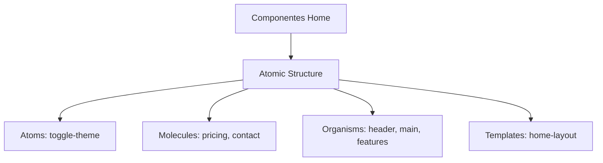

# Plan de Migración a Atomic Design - Módulo Home

## 1. Auditoría Inicial

Componentes a migrar:

- header.tsx (Organismo)
- main.tsx (Organismo)
- features.tsx (Organismo)
- pricing.tsx (Molecule)
- contact.tsx (Molecule)
- toggle-theme.tsx (Atom)



## 2. Criterios de Categorización

| Categoría | Características                           | Ejemplo               |
| --------- | ----------------------------------------- | --------------------- |
| Atom      | Elementos UI básicos sin estado           | Botones, Inputs       |
| Molecule  | Combinaciones simples de Atoms con props  | Formularios           |
| Organism  | Secciones complejas con lógica contextual | Header con navegación |
| Template  | Layouts estructurales para páginas        | Grid de contenido     |

## 3. Estrategia de Refactorización

1. Crear estructura en `src/components/ui/home/`

```bash
components/
    home/
        atoms/
        molecules/
        organisms/
        templates/
```

2. Migración progresiva por niveles:

- Fase 1: Atoms (1 día)
- Fase 2: Molecules (2 días)
- Fase 3: Organisms (3 días)
- Fase 4: Templates (1 día)

## 4. Sistema de Testing

- Jest: Pruebas unitarias por categoría
- Cypress: Flujos E2E entre componentes
- Coverage mínimo: 80% por categoría

## 5. Plan de Implementación

| Fase | Duración | Componentes                        |
| ---- | -------- | ---------------------------------- |
| 1    | 2 días   | toggle-theme → atoms               |
| 2    | 3 días   | pricing, contact → molecules       |
| 3    | 5 días   | header, main, features → organisms |
| 4    | 2 días   | Integración Storybook              |

## 6. Documentación Técnica

- Storybook: Documentar variantes por categoría
- ADR: Decisión arquitectónica en `/docs/decisions`
- JSDoc: Comentar props y tipos complejos

## 7. Control de Versiones

- Feature flags por componente
- Git branches temporales (max 2 días)
- Rollback automático con CI/CD

## 8. Integración Storybook

- Crear stories para cada categoría
- Visual testing con Chromatic
- Documentar casos de uso complejos

## 9. Validación Cross-Team

| Equipo     | Responsabilidad                       |
| ---------- | ------------------------------------- |
| Diseño     | Validar implementación sistema diseño |
| Desarrollo | Revisar patrones de implementación    |
| QA         | Verificar casos de prueba end-to-end  |

## 10. Métricas Post-Migración

- Rendimiento: Tiempo de carga componentes
- Mantenibilidad: Complexidad ciclomática
- Consistencia: % de código duplicado
